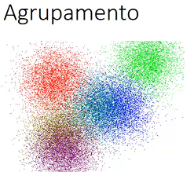

`README_Conceitos_AI.md`

##### Índice remissivo

* [Introdução](#1-introdu%C3%A7%C3%A3o)
* [IC, AI, ML e DL](#21-ic-ai-ml-e-dl)
    * [Inteligência Computacional](#intelig%C3%AAncia-computacional)
    * [AI - Artificial Intelligence (Inteligência Artificial)](#ai---artificial-intelligence-intelig%C3%AAncia-artificial)
    * [ML - Machine Learning](#ml---machine-learning)
    * [DL - Deep Learning](#dl---deep-learning)
    * [AI vs ML vs DL](#dl---deep-learning)
  * [Dados, atributos, qualidade, quantidade e escala](#22-dados-atributos-qualidade-quantidade-e-escala)
    * [DataSet ou conjunto de Dados](#dataset-ou-conjunto-de-dados)
    * [Data Mining](#data-mining)
    * [Dado imperfeito ou ruído](#dado-imperfeito-ou-ru%C3%ADdo)
    * [Tipos de atributos Qualitativo](#tipos-de-atributos-qualitativo)
    * [Tipos de atributos Quantitativo](#tipos-de-atributos-quantitativo)
    * [Escalas de atributos](#escalas-de-atributos)
  * [Aprendizado](#23-aprendizado)
    * [Tarefas de aprendizado](#tipos-de-aprendizado)
    * [Tipos de aprendizado](#tipos-de-aprendizado)
      * [Preditivas vs Descritivas](#preditivas-vs-descritivas)
      * [Dedutivo vs Indutivo](#dedutivo-vs-indutivo)
      * [Classificação, Regressão, Sumarização, Agrupamento, Detecção de Desvios e Padrões sequenciais](#classifica%C3%A7%C3%A3o-regress%C3%A3o-sumariza%C3%A7%C3%A3o-agrupamento-detec%C3%A7%C3%A3o-de-desvios-e-padr%C3%B5es-sequenciais)
    * [Processo de aprendizado](#24-processo-de-aprendizado)
      * [Supervisionado](#supervisionado)
      * [Não-supervisionado](#n%C3%A3o-supervisionado)
      * [Semi-supervisionado](#semi-supervisionado)
      * [Por reforço](#por-reforço)
    * [Algoritmos Fundamentais em Machine Learning](#25-algoritmos%20fundamentais%20em%20machine%20learning)
      * Redes Neurais, Árvore de Decisão, KNN, K-Means, Redes Bayesianas, Máquina de vetor de suporte (SVMs), Clusterização, Regressão Linear (Simples, Múltipla)
    * [Inteligência artificial ou humana?](#26-intelig%C3%AAncia-artificial-ou-humana)
      * [Teste de Turing](#teste-de-turing)
* [Referências](#referências)

## 1. Introdução ##

Neste capítulo separei referências para conceitos, definições, terminologias e glossário

## 2. Conceitos

## 2.1. IC, AI, ML e DL

#### Inteligência Computacional
Inteligência Computacional é uma área bem vasta e bem estabelecida. É um termo preferido pelos profissionais da ciência de computação para  substituir "Inteligência Artificial" porque remete a computação. IEEE considera as técnicas de: Redes Neurais, Computação Evolucionária e Lógica Nebulosa (Fuzzy). O uso prático: Netflix, Google, Amazon, WhatsApp corretor ortográfico (processamento de linguagem natural). 

#### _AI_ - Artificial Intelligence (Inteligência Artificial) 
A teoria e desenvolvimento de sistemas computacionais capazes de executarem tarefas que normalmente requeriam a inteligêcia humana. Surgiu logo após a 2a guerra mundial. Está ligado ao desenvolvimento de sistemas que simulem a capacidade humana de resolver problemas.

#### _ML_ - Machine Learning
O campo da ciência que usa técnicas estatísticas para dar aos sistemas computacionais a habilidade de "ler", isto é que progressivamente melhore o desempenho da execução de uma tarefa específica com dados, sem terem sido explicitamente programados para tal.

#### _DL_ - Deep Learning
É parte do _ML_ Machine Learning que utiliza métodos baseado no aprendizado de dados, diferentemente de tarefas baseadas em algorítimos.

#### _AI_ vs _ML_ vs _DL_

## 2.2. Dados, atributos, qualidade, quantidade e escala

### DataSet ou conjunto de Dados
Em _AI_, um programa aprende a partir de uma experiências, que pode ser provida por um conjunto de dados. Exemplo: dados de pacientes de um hospital, identificador, nome, idade, peso, temperatura, presença de manchas, etc.  O dado também é chamado de objeto, exemplo, amostra, registro ou padrão.

### Data Mining
Extrair conhecimento de base de dados usando métodos de aprendizado de máquina.

### Dado imperfeito ou ruído
Quando em um conjunto de treinamento, pelo menos um dos atribudos não está disponível ou é inválido no domínio.

### Tipos de atributos Qualitativo
Um atribuito **qualitativo**, também chamado de simbólico ou categórico, representa qualidade ou seja valores podem ser associados a categorias. Podem ser **ordenados**, porém **operações aritméticas** não podem ser aplicadas.  Ex: nome, sexo, 

### Tipos de atributos Quantitativo
Um atribuito **quantitativo**, também chamado de numérico, ele representa quantidades. Eles podem ser divididos em **contínuos** ou **discretos**. O atributo **quantitativo contínuo** podem assumir número infinito de valores, frequentemente representado por um número real.
ou seja valores podem ser associados a categorias. Podem ser **ordenados**, porém **operações aritméticas** não podem ser aplicadas.  Ex: numero de internações.

### Escalas de atributos
Escala de atribuitos define operações que podem ser aplicadas aos atributos, que podem ser:
* **qualitativo nominais**: Os valores são nomes diferentes e carregam a menor quantidade de informação possível. Não existe relação de ordem entre os valores. As operações aplicáveis são:  `=` **igualdade** ou `!=`**diferança**. Ex: Cor, Sexo, Id
* **qualitativo ordinais**: Os valores refletem ordem das categorias representadas. As operações aplicáveis são: `=`, `!=`, `<`, `<=`, `>`, `>=`. Exemplo: Hierarquia militar, avaliação qualitativa de grande, pequena. 
* **quantitativo racionais**: Os valores tem significado absoluto. As operações aplicáveis são: `+` adição, `-` subtração, `*` multiplicação e `/` divisão, além das operações `=`, `!=`, `<`, `<=`, `>` e `>=`. Exemplos: peso, quantidade de algum atributo.
* **quantitativo intervalares**: Os valores tem significado quantitativo e variam dentro de um intervalo. As operações aplicáveis são: `+` adição, `-` subtração, além das operações `=`, `!=`, `<`, `<=`, `>` e `>=`. Exemplos: Temperatura.

## 2.3. Tipos de Aprendizado

### Preditivas vs Descritivas
* **Preditivas**: Encontrar uma função, modelo ou hipótese que pode ser utilizada para prever um rótulo ou valor. Ex: prever o valor de um imóvel ou um rótulo de doente/saudável para um paciente.
* **Descritivas**: Explorar ou descrever um conjunto de dados, pois não possuem saída associada.

### Dedutivo vs Indutivo
* **Aprendizado Dedutivo**:  as premissas fornecem um fundamento definitivo da conclusão
* **Aprendizado Indutivo**:  as premissas proporcionam somente alguma fundamentação da conclusão, mas não uma fundamentação conclusiva, identificando dessa maneira os conceitos de dedução e raciocínio válido

### Classificação, Regressão, Sumarização, Agrupamento, Detecção de Desvios e Padrões sequenciais

* **Aprendizado Supervisionado**: Preditivo, possue um __supervisor externo__. É conhecido a saída desejada para cada exemplo. Ex: situação de um paciente no hosmpital. 
  * **Classificação**: Nas situações desejamos prever uma classe ou categoria — se uma pessoa tem ou não uma doença, ou seja, uma resposta final binária {sim, não} ou se uma pessoa deve receber ou não crédito do banco com base no seu histórico como cliente, a saída mais uma vez é um simples {sim, não}. Logo não há um rótulo discreto. Exemplo: diagnóstico(saudável,doente), bom/mau pagador, etc.
  * **Regressão**: Usamos algoritmos de regressão quando nosso objetivo é prever um valor numérico — prever valor da casa em um determinado bairro, prever valor de vendas para o próximo mês. Nestas situações não tem rótulos discretos, pois eles são contínuos. Exemplo: peso, altura, etc.

* **Aprendizado Não-Supervisionado**: Descritivo.  Os algorítimos não fazem uso de atributos de saída, eles exploram as regularidades nos dados
  * **Sumarização**: Encontrar descrição compacta dos dados.
  * **Associação**: Encontrar padrões frequentes de associações entre atributos.
  * **Agrupamento**: agrupamento por similaridade ou subconjuntos ou cluster.
  * **Detecção de desvios**: Identificar elementos que destoam do todo
  * **Padrões sequenciais**: Identificar comportamentos sequenciais

PS: Não é uma subdivisão rígida, mas didatica:

## 2.4. Processo de aprendizado

### Supervisionado
No aprendizado supervisionado, o programa é __treinado__ sobre um conjunto de dados pré-definidos. Baseado no treinamento com dados pré-definidos o programa pode tomar decisão para novos dados. Ex: análise de sensibilidade de tweets (positivo ou negativo). O objetivo é a partir do passado, prever o que se segue. 
A **classificação** é uma subcategoria do aprendizado supervisionado, cujo processo consiste em atribuir um rótulo para uma nova amostra.
A **regressão** é uma subcategoria do aprendizado supervisionado, quando o valor tem um espectro contínuo podemos utilizar regressão.

### Não-supervisionado
Mesmo com exemplos não rotulados é possível encontrar __padrões__ os padrões existentes dados. Isto é muito usado em uma abordagem chamada __DataMinig__. É possível fazer organização de padrões consistentes nos dados, ou __clustes__. O objetivo é extrair informações relevantes de dados __não rotulados__.

### Semi-supervisionado
Utiliza dados rotulados e não rotulados no treinamento. Normalmente uma pequena quantidade de dados rotulado com uma grande quantidade de dados não rotulados (que são obtidos com menos esforço)

### Por reforço
O algorítmo aprende por tentativa e erro. 

## 2.5. Algoritmos Fundamentais em Machine Learning

Os principais algorítmos   são:

* Regressão Linear
* Regressão Logística
* Árvores de Decisão
* Random Forest
* Máquinas de Vetor de Suporte
* Naive Bayes
* K-Nearest Neighbors (KNN)
* K-Means
* Principal Component Analysis
* Gradient Boosting e AdaBoost

Para saber mais detalhes dos algorítimos acesse:

* [10 algoritmos fundamentais em Machine Learning](https://medium.com/data-hackers/10-algoritmos-fundamentais-em-machine-learning-c673b1034a0)
* [Um tour pelos 10 principais algoritmos de Machine Learning](https://ilumeo.com.br/todos-posts/2020/06/22/um-tour-pelos-10-principais-algoritmos-de-machine-learning)
* [Como funciona Machine Learning](https://opencadd.com.br/o-que-e-machine-learning/)
* [Uma visão geral sobre Machine Learning - Classificação](https://operdata.com.br/blog/uma-visao-geral-sobre-machine-learning/)

PS: 
* Não existe a **melhor** técnica e sim a mais adequada levando em consideração os dados e tempo de espera.

## 2.6. Inteligência artificial ou humana?

### Teste de Turing
O [Teste de Turing](https://pt.wikipedia.org/wiki/Teste_de_Turing) testa a capacidade de uma máquina exibir comportamento inteligente equivalente a um ser humano, ou indistinguível deste.

# Referências

* Vídeo [Inteligência Artificial, Machine Learning e Deep Learning (Exemplos e Diferenças)](https://www.youtube.com/watch?v=5UYpSE3dQSQ&list=PLORrDfZD1hkE-STpneL0hV3_m2tjv0qAq) - Introdutório dos conceitos, mostra a diferença entre AI vs ML vs DL, para não técnicos de forma bastante simples e efetiva
* Vídeo [Robo Leo aprendendo a andar](https://www.youtube.com/watch?v=SBf5-eF-EIw)
* Vídeo [Teste de Turing](https://www.youtube.com/watch?v=WWmblRWRdLc)
* [Fundamentos Data Science](https://jvilar.wordpress.com/2017/01/29/fundamentos-de-data-science-machine-learning-parte-1/)
* Play-List Inteligência Artificial - Felipe Deschamps
  * [Qual a diferença entre Inteligência Artificial, Machine Learning, Data Science, Deep Learning, etc?](https://www.youtube.com/watch?v=ccZ2pyr3YDw&list=PLMdYygf53DP7YZiFUtGTWJJlvynRyrna-&index=2)
  * [MELHOR FORMA DE APRENDER PYTHON (Google Colab Notebook)](https://www.youtube.com/watch?v=Gojqw9BQ5qY&list=PLMdYygf53DP7YZiFUtGTWJJlvynRyrna-&index=3)
  * [Data Science: Introdução a Ciência de Dados (Primeira aula prática programando em Python)](https://www.youtube.com/watch?v=F608hzn_ygo&list=PLMdYygf53DP7YZiFUtGTWJJlvynRyrna-&index=4)
  * [Machine Learning: Tutorial prático usando apenas o navegador (é sensacional!!!)](https://www.youtube.com/watch?v=JyGGMyR3x5I&list=PLMdYygf53DP7YZiFUtGTWJJlvynRyrna-&index=5)
  * [Data Visualization: crie os melhores gráficos para os seus dados](https://www.youtube.com/watch?v=qLiEDvs57nk&list=PLMdYygf53DP7YZiFUtGTWJJlvynRyrna-&index=6)
