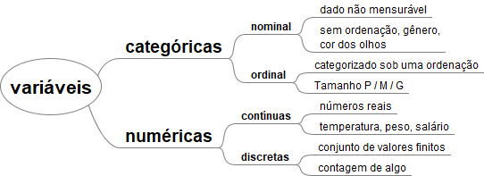

`README_MachineLearningDataSciencePython.md`

#### Índice Remissivo

* Pré-processamento
  * Etapas do pré-processamento
  * Tipos de variáveis
* Classificação
  * Naive Bayes
  * Árvore de Decisão
  * Random Forest
  * Regras
  * KNN
  * Regressão logística
  * SVM
  * Redes neurais artificiais
  * Avaliação de algorítmos
  * Combinação e rejeição de classificadores
* Regressão
  * Regressão linear simples
  * Regressão linear múltipla
  * Regressão polinomial
  * Árvores de decisão
  * Random Forest
  * SVM 
  * Redes neurais artificiais
* Associação
  * Algorítmo Apriori
  * Algorítmo ECLAT
  * Bases de dados do mercado
* Agrupamento
  * Algorítmo k-means
  * Agrupamento hierarárquico
  * DBSCAN
  * Base de cartão de créditos
* Tópicos complementares
  * Aprendizagem por reforço
  * Processamento de linguagem natural
  * Visão computacional
  * Dados desbalanceados
  * Seleção de atributos
  * Redução de dimensionalidade (PCA e LDA)
  * Detecção de outliers
  * Séries temporais

## 1. Introdução

Este repositório contém os artefatos do estudo sobre Machine Learning e Data Science utilizando a linguagem Python.

## 2. Roteiro de Estudo

### 2.1. Pré-processamento

#### 2.1.1. Etapas Pré-processamento

A etapa de pré-processamento consiste em:
* Carregar os dados
* Tratar valores inconsistentes
* Tratar valores faltantes
* Escalonamento de atributos
* Transformação de variáveis categóricas
* Introdução a avaliação de algorítimo
* Separação em base de dados de Treinamento e Testes

É comum o uso da ferramenta **scikit-learn** na etapa de pré-processamento.

#### 2.1.2. Tipos de variáveis

O tipo de variável é importante para o correto modelamento e uso dos parâmetros das bibliotecas que serão chamadas.

* *Numéricas*
  * Contínuas (reais): representa valores quantitativos. Ex: temperatura, pressão, altura
  * Discretas (inteiros): conjunto de valores finitos ou contagem de alguma coisa
* Categóricas (string):
  * Nominal: dados não mensuráveis, sem ordenação, cor dos olhos, gênero, nome
  * Ordinal: categorizado sobre uma ordenação. Ex: Pequeno, Médio e Grande

#### 2.1.3. Split Dataset into learn, validation and test set

* [Splitting a Dataset into Train and Test Sets](https://www.baeldung.com/cs/train-test-datasets-ratio)
* [Splitting a dataset](https://towardsdatascience.com/splitting-a-dataset-e328dab2760a)
* [A Method for Optimal Division of Data Sets for Use in Neural Networks](https://link.springer.com/chapter/10.1007/11554028_1)

### 2.2. Classificação

### 2.2.1. Naive Bayes

* Abordagem probabilistica
* Exemplo de uso:
	* Filtros de SPAM
	* Mineração de emoção
	* Separação de documentos
* Estudo de caso: avaliação de risco de crédito imobiliario de uma base de dados
	* Atributos
		* Histórico de crédito: [ `Boa`, `Ruim`, `Desconhecida` ]
		* Dívidas: [ `Alta`, `Baixa` ]
		* Garantias: [ `Adequada`, `Nenhuma` ]
		* Renda anual: [ `< 15000`, `>= 15000` e `<= 35000`, `> 35000` ]
	* Algorítimo
		- Montar uma tabela de probabilidade com cada uma das combinações
    - No caso de iterações: probabilidade anterior (apriori) e posterior a iteração (posteriori)
  * Resultados esperados
		- atributo classificação de risco: [ `Alto`, `Moderado`, `Baixo`] 
  * Vantagens: rápido, simplicidade de interpretação, trabalha com altas dimensões (muitos atributos), boas previsões em base de dados pequenas
  * Desvantagens: combinação de características (atributos independentes) cada par de atributos são independentes e não considera correlação

## I - Referências

* [Machine Learning & Data Science com Python](https://www.udemy.com/course/machine-learning-e-data-science-com-python-y)
* https://iaexpert.academy/
* https://www.youtube.com/channel/UCaGrIWpwjWXT6OIQh9W4Riw