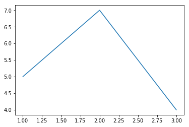
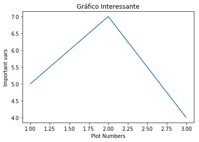
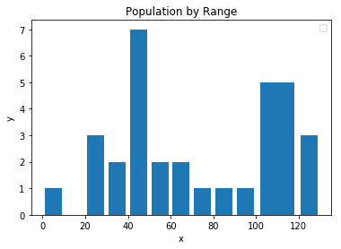
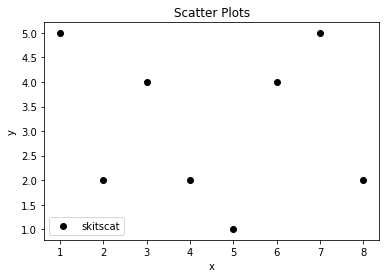

# README Python Matplotlib

## 1. Introdução ##
O objetivo deste documento é apresentar a biblioteca de visualização gráfica do Python **Matplotlib**. O **Matplotlib** é uma biblioteca Python para gráfico.


## 2. Guia de Uso

* Jupyter-Notebook deste exercício disponível [PythonMatplotlib.ipynb](../src/ipynb/05-PythonMatplotlib/PythonMatplotlib.ipynb)

## 2.1. Instalação
* Para instalar o **Matplotlib** :

```cmd
pip3 install matplotlib
```

## 2.2. Matplotlib vs Jupyter-Notebook
* Para utilizar o **Matplotlib** no **Jupyter-Notebook** é necessário a diretiva `%matplotlib inline`

```ipynb
%matplotlib inline
```

## 2.3. Mostrando a primeira Lista de valores Python com Matplotlib no Jupyter-Notebook
```ipynb
%matplotlib inline
import matplotlib.pyplot as plt

plt.plot([1,2,3],[5,7,4])
plt.show()
```



## 2.4. Títulos de eixo - xlabel(), ylabel(), title()
* xlabel(), ylabel(), title()

```ipynb
import matplotlib.pyplot as plt
x = [1,2,3]
y = [5,7,4]

plt.plot(x,y)
plt.xlabel('Plot Numbers')
plt.ylabel('Important vars')
plt.title('Gráfico Interessante\nsee details')
plt.show()
```




## 2.5. Mais de uma linha no gráfico 2D com lables
* `matplotlib.plot( .., label='' )`

```ipynb
import matplotlib.pyplot as plt
x = [1,2,3]
y = [5,7,4]

x2 = [1,2,3]
y2 = [10,14,12]

plt.plot(x,y, label='First Line' )
plt.plot(x2,y2, label='Second Line' )
plt.xlabel('Plot Numbers')
plt.ylabel('Important vars')
plt.title('Gráfico Interessante\nsee details')
plt.show()
```


## 2.6. Bar Chart e Histogram
* matplotlib.bar(), matplotlib.hist()

```ipynb
import matplotlib.pyplot as plt

# Bar Chart ...

x = [2,4,6,8,10]
y = [6,7,8,2,5]
x2 = [1,3,5,7,9]
y2 = [7,8,2,4,2]


plt.bar(x,y,label='Bars1', color='r') # one letter color r->red
plt.bar(x2,y2,label='Bars2', color='b')

plt.xlabel('x')
plt.ylabel('y')
plt.title('Graph Bar Chard')
plt.legend()
plt.show()

# Histogram ...

population_ages = [22,55,62,45,21,22,34,42,42,4,99,102,110,120,121,130,111,115,112,80,75,65,54,44,43,41,34,48]
ids = [x for x in range(len(population_ages))] # create list 0, 1, 2, ... number of elements

plt.bar(ids,population_ages)

plt.xlabel('x')
plt.ylabel('y')
plt.title('Populations')
plt.legend()
plt.show()

population_ages = [22,55,62,45,21,22,34,42,42,4,99,102,110,120,121,130,111,115,112,80,75,65,54,44,43,41,34,48]
bins = [0,10,20,30,40,50,60,70,80,90,100,120,130]

plt.hist(population_ages,bins, histtype='bar', rwidth=0.8)

plt.xlabel('x')
plt.ylabel('y')
plt.title('Population by Range')
plt.legend()
plt.show()
```





## 2.7. Scatter Plots
* `matplotlib.scatter()`
* Os [markers](https://matplotlib.org/api/markers_api.html?highlight=markers#module-matplotlib.markers) definem a imagem do objeto que será mostrado no gráfico

```ipynb
import matplotlib.pyplot as plt

x = [1,2,3,4,5,6,7,8]
y = [5,2,4,2,1,4,5,2]

plt.scatter(x,y, label='skitscat', color='k', marker='^') # marker 'o'=bolinha, '*'=estrela '^'=triangle

plt.xlabel('x')
plt.ylabel('y')
plt.title('Scatter Plots')
plt.legend()
plt.show()
```




## 2.8. Stack Plots (gráficos empilhados)
* `matplotlib.stackplot()`
* Você não poderá ter rótulos de legendas para stack plot, para contornar este problema você pode fazer um plot dentro do outro

```ipynb
import matplotlib.pyplot as plt

days = [1,2,3,4,5]
sleeping = [7,8,6,5,11]
eating = [2,3,4,3,2]
working = [7,8,7,2,2]
playing = [8,5,7,8,13]

plt.plot([],[],color='m',label='Sleeping', linewidth=5)
plt.plot([],[],color='c',label='Eating', linewidth=5)
plt.plot([],[],color='r',label='Working', linewidth=5)
plt.plot([],[],color='k',label='Playing', linewidth=5)


plt.stackplot(days, sleeping, eating, working, playing, colors=['m','c','r','k'])

plt.xlabel('x')
plt.ylabel('y')
plt.title('Stack Plot')
plt.legend()
plt.show()
```


### 2.9. Pie Chart
* pie(), colors, startangle, shadow, explode

```ipynb
import matplotlib.pyplot as plt

days = [1,2,3,4,5]
sleeping = [7,8,6,5,11]
eating = [2,3,4,3,2]
working = [7,8,7,2,2]
playing = [8,5,7,8,13]

slices = [7,2,2,13]
activities = ['sleeping', 'eating', 'working', 'playing']
clrs = ['c', 'm', 'r', 'b']

# pie chart
plt.pie(slices,labels=activities,colors=clrs,startangle=90,shadow=True,explode=(0,0.1,0,0), autopct='%1.1f%%')

#plt.xlables('x')
#plt.ylabels('y')
plt.title('Pie Chart')
#plt.legend()
plt.show()
```


## 2.10. Carregando dados do gráfico de arquivo 
* `import csv`, `with open('...','r') as ...`
* `numpy.loadtext(.., delimiter=',', unpack)` 

```ipynb
import matplotlib.pyplot as plt
import csv

x = []
y = []

with open('exemplo-01.csv', 'r') as csvfile:
    plots = csv.reader(csvfile,delimiter=',')
    for row in plots:
        x.append(int(row[0]))
        y.append(int(row[1]))

plt.plot(x,y)

plt.xlabel('x')
plt.ylabel('y')
plt.title('Load from file - Using with open()')
plt.legend()
plt.show()
```

```ipynb
import matplotlib.pyplot as plt
import numpy as np

x,y = np.loadtxt('exemplo-01.csv', delimiter=',', unpack=True)

plt.plot(x,y)

plt.xlabel('x')
plt.ylabel('y')
plt.title('Load from file - Using with open()')
plt.legend()
plt.show()
```


# Referências

* [Matplotlib Org Tutorial](https://matplotlib.org/tutorials/index.html)
* [How to make IPython notebook matplotlib plot inline](https://stackoverflow.com/questions/19410042/how-to-make-ipython-notebook-matplotlib-plot-inline)
* [Vídeo muito bom Python - Matplotlib Tutorial for Beginners](https://www.youtube.com/watch?v=qErBw-R2Ybk)
* [Vídeo - Matplotlib Tutorial](https://www.youtube.com/watch?v=q7Bo_J8x_dw&list=PLQVvvaa0QuDfefDfXb9Yf0la1fPDKluPF)
