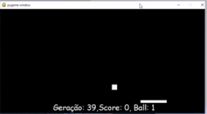

# README Python Pygame Artificial Intelligence Rede Neural Artificial

# 1. Introdução

O objetivo deste documento é reproduzir o experimento do Weuler Filho (veja as referências) que fazer uma Rede Neural aprender um jogo simples de coleta.

# 2. Guia de Programação

## 2.1. Explicações básicas

O jogo tem nome de ping-pong mas trata-se de bolinhas que caem do topo superior da tela e você deve movimentar uma barrinha que fica na parte inferior da tela, restrito aos movimentos `esquerda` ou `direita` para pegar as bolinhas que foram soltas aleatoriamente.

O **[DataSet](README_Conceitos_AI.md)** de aprendizado foi gerado manualmente, isto é trata-se de um **Aprendizado Supervisionado**, o Weuler Fillho jogou por um bom tempo  fazendo os movimentos corretos atrás das bolinhas e guardou este **DataSet** de gabarito no pasta `base_weuler`. Porém, através do aplicativo `CatchGameColetor.py` você pode jogar e gerar os dados do **DataSet** supervisionado. Ao executar este programa, ele captura os seus movimentos em um arquivo.

O código fonte encontra-se em `./src/py/01-JogoPegaBolinhaLancada`. Neste diretório você ai encontrar os seguintes arquivos e sub-diretórios:
* `base_weuler`: Diretório que contém histórico dos atributos de várias horas de jogo, que foram utilizados no **aprendizado supervisionado**  
* `CatchGameColetor.py`: Este é o programa de coleta de atributos do **aprendizado supervisionado**. Para executá-lo você deve executar na linha de comando `python CatchGameColetor.py` e jogar para não deixar a bolinha cair. Ao final do jogo, isto é quando você perder, o programa grava um arquivo no diretorio prefixado por "base_weulerNNNNNNNNN" com os atributos sucesso. 
* `NeuralCatchGame.py`: Este é o programa que executa a rede neural com os pesos e atributos aprendidos no **aprendizado supervisionado**.
* `NeuralNet.py`: Este é o programa da **rede neural**. Ele abre todos os arquivos abaixo do sub-diretórios `base_weuler`, le o seu conteúdo e armazena em duas estruturas de listas :`input` o primeiro elemento e `output` o segundo elemento dos dados do arquivo.
* `w1`: Este arquivo é uma saída do programa `NeuralNet.py`
* `w2`: Este arquivo é uma saída do programa `NeuralNet.py`

## 2.2. Entendendo o programa `NeuralNet.py`

* O programa `NeuralNet.py` importa as bibliotecas `numpy` para manipular array's mais facilmente; a bibliotecas `json` para armazenar os dados; `os` para leitura e escrita de arquivo;
* Há uma classe chamada `NeuralNet` que além do construtor `__init__`, implementa os métodos `feedforward` e `backpropagation`
* Você pode pular até o trocho da linha +/- 56 onde tem o comando `if __name__ == "__main__":` onde inicia a execução do programa
* Entre as linhas 58-73 o programa faz um loop em todos os arquivos do sub-diretório `base_weuler`, lê o conteúdo dos arquivos em uma lista `data` e em seguida monta dois array's numpy ( `input`, `out` ) com respectivamente o primeiro e o segundo elemento de ` data`.
* Entre as linhas 74-74 o programa chama a classe `NeuralNet` passando como parâmetros os dois array's NumPy `input` e `out`. 
* Entre as linhas 10-29, o código da classe `NeuralNet` gera dois novos NumPy Array's `weights_input` e `weights_outpu`, randomicamente `np.random.rand(p1,p2)` com base nos dois arrays recebidos e parâmetros de `input_size` e `output_size`.

# Referências

* [Vídeo Aprenda a Jogar Ping Pong usando Rede Neural](https://www.youtube.com/watch?v=ETn61j8kIaU&t=78s)
* [Código Fonte](https://github.com/filhoweuler/SnakeIA/tree/master/catch_game)