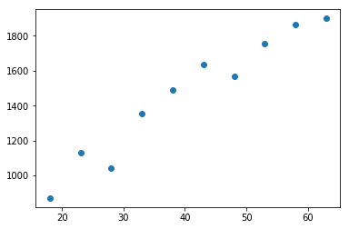

# README Python Regressão Linear com NumPy Matplotlib e TensorFlow

# 1. Introdução

O objetivo deste documento é explorar **Regressão Linear** com **Python**, a biblioteca **NumPy**, a biblioteca **TensorFlow** e aplicação à **AI - Artificial Intelligence**.


PS: Baseado no treinamento do Youtuber [Jones Granatyr](https://www.youtube.com/channel/UCaGrIWpwjWXT6OIQh9W4Riw)


## 1.1 Pré-requisitos

* TensorFlow Instalado - [Instruções para instalação](https://www.tensorflow.org/install/pip))

```cmd
$ conda create -n tensorflow python=3.7
$ conda activate tensorflow
$ conda install python=3.6.5
$ pip install tensorflow
```


# 2. Documentação


* Jupyter-Notebook deste exercício disponível [PythonNumPy.ipynb](../src/ipynb/07-PythonRegressaoLinearNumPyMatplotlibTensorFlow/PythonRegressaoLinearNumPyMatplotlibTensorFlow.ipynb)


## 2.1. O que é Regressão Linear
[Regressão LInear ](README_Conceitos_AI#regressao_linear) em estatística ou econometria, regressão linear é uma equação para se estimar a condicional (valor esperado) de uma variável y, dados os valores de algumas outras variáveis x.


## 2.2. Regressão Linear: Previsão vs Classificação
No contexto de **Regressão Linear**, vejamos as semelhanças e diferenças entre **Previsão** e **Classificação**:


* Semelhanças entre **Previsão** e **Classificação**:
    * Constrói-se um modelo de relação das variáveis numéricas (variável dependente **y** e variável explanatória **x** (ou atributos previsores)
	* Usa-se o modelo para prever valores desconhecidos
* Diferenças entre **Previsão** e **Classificação**:
    * **Previsão** é apropriada para modelar funções contínuas
    * **Classificação** diz respeito à previsão de um rótulo de uma classe

## 2.3. Tipos de regressão linear
* **Regressão linear simples**: quando temos uma única variável explanatória (x)
* **Regressão Linear Múltipla**: Regressão múltipla é uma coleção de técnicas estatísticas para construir modelos que descrevem de maneira razoável relações entre várias variáveis explicativas de um determinado processo. A diferença entre a regressão linear simples e a múltipla é que na múltipla são tratadas duas ou mais variáveis explicativas.

	
## 2.4. Exemplos
* {Temperatura, umidade e pressão do ar} (x) `->` velocidade do vento (y)
* {Gastos no cartão de crédito, histórico} (x)  `->` limite do cartão (y)
* Idade (x) `->` custo do plano de saúde
* Tamanho da casa (x) `->` preço da casa


## 2.5. Exemplo gráfico: idade vs custo plano de saúde

* Com base na idade da pessoa, queremos utilizar regressão linear para prever o custo do plano de saúde.
* Supondo a variável explanatória __idade__ (x), com base no histórico desejamos prever a variável dependente __custo do plano de saúde__ (y) 
* O processo de **aprendizado** no algorítimo de **Regressão Linear** é encontrar os melhores valores para `b0` e `b1`
* O parâmetro `b1` é considerado o declive da linha


## 2.6. Modelo matemático, erro

* Para avaliar se a modelo da reta traçada está se adequando aos pontos existentes, calcula-se o erro de cada ponto até a linha
* Para medir o **erro** a técnica mais utilizada é o **Mean Square Error** ou método dos mínimos erros ao quadrado
* O método **Mean Square Error** penaliza os maiores erros


* Para fazer a minimização dos erros, há duas estratégias de cálculo:
    * **Design Matrix**: Álgebra Linear
        * Base de dados com poucos atributos
        * Inversão de matrizes tem custo computacional alto
    * **Gradient Descent**: Descida do Gradiente
        * Desempenho melhor com muitos atribuitos


## 2.7. Regressão Linear - NumPy Array

* Criando um NumPy Array com os vetores `x` e `y`

```ipynb
import numpy as np
x = np.array([[18],  [23],   [28],   [33],   [38],   [43],   [48],   [53],   [58],   [63]   ])
y = np.array([[871], [1132], [1042], [1356], [1488], [1638], [1569], [1754], [1866], [1900] ])

print('\nx:')
for e in x:
    print(e, end=', ')
    
print('\ny:')
for e in y:
    print(e, end=', ')
```

```console
x:
[18], [23], [28], [33], [38], [43], [48], [53], [58], [63], 
y:
[871], [1132], [1042], [1356], [1488], [1638], [1569], [1754], [1866], [1900], 
```


## 2.8. Regressão Linear - Visão gráfica com Matplotlib 

* No Jupyter-Notebook precisamos fazer o código `%matplotlib inline`

```ipynb
import matplotlib.pyplot as plt
%matplotlib inline
plt.scatter(x,y)
```




## 2.9. Regressão Linear - TensorFlow escalonamento dos valores ( `sklearn.preprocessing` )

* Para trabalhar com **Regressão Linear** no **TensorFlow** precisamos fazer um processo chamado **Escalonamento de valores**, que consiste em transformar os valores de `x` e `y` na __mesma escala de valores__

```ipynb
from sklearn.preprocessing import StandardScaler
scaler_x = StandardScaler()
x_scaled = scaler_x.fit_transform(x)

from sklearn.preprocessing import StandardScaler
scaler_y = StandardScaler()
y_scaled = scaler_y.fit_transform(y)

print('\nx_scaled:')
for e in x_scaled:
    print(e, end=', ')
    
print('\ny_scaled:')
for e in y_scaled:
    print(e, end=', ')
```

* Não precisa se assustar com a advertência de que o array de números inteiros com dtype `int32` foi convertido em `float64`

```console
C:\ProgramData\Anaconda3\lib\site-packages\sklearn\utils\validation.py:475: DataConversionWarning: Data with input dtype int32 was converted to float64 by StandardScaler.
  warnings.warn(msg, DataConversionWarning)
```

* Observe que os valores foram escalonados:

```console
x_scaled:
[-1.5666989], [-1.21854359], [-0.87038828], [-0.52223297], [-0.17407766], [0.17407766], [0.52223297], [0.87038828], [1.21854359], [1.5666989], 
y_scaled:
[-1.75751985], [-0.98083058], [-1.24865447], [-0.31424669], [0.07856167], [0.52493481], [0.31960317], [0.87013004], [1.20342199], [1.3045999], 
```


## 2.10. Regressão Linear - Definição da __fórmula__ ou **modelo matemático** para a **Regressão Linear**

* Criação da __fórmula__ ou __modelo matemático__ da **Regressão Linear Simples**
    * `y = b0 + b1 * x`
* O objetivo da **Regressão Linear Simples** do TensorFlow é econtrar os parâmetos `b0` e `b1`. O **TensorFlow** vai executar vários processamentos, usa a descida do gradiente para encontrar o melhor conjunto dos dois parâmetros. 
* Quando o **TensorFlow** executa pela primeira vez em geral ele vai inicializar os parâmetros de forma aleatória. Nós iremos inicializar os valores `b0` e `b1` com valores aleatórios

```ipynb
np.random.seed(0) # inicializa a semente para que a partir deste momento seja os mesmos valores
np.random.rand(2) # gera dois valores aleatórios
```

* Importar biblioteca do **TensorFlow**, crair as duas variáveis `b0` e `b1`. O **TensorFlow** faz uso das funções randômicas para geração de números aleatórios.
* O **TensorFlow** usa variáveis com modelos de **Machine Learning** para **otmizar** valores de `b0` e `b1`. Ele inicia com estas variáveis e vai ajustando até que ele tenha um valor interssante.


```ipynb
import tensorflow as tf
b0 = tf.Variable(0.54)
b1 = tf.Variable(0.71)
```

	
    
# Referências

* [Wikipedia Regressão Linear](https://pt.wikipedia.org/wiki/Regress%C3%A3o_linear)
* [Vídeo Introdução a Regressão Linear](https://www.youtube.com/watch?v=ltRVgNsZBXE&list=PLORrDfZD1hkE-STpneL0hV3_m2tjv0qAq)
* [Installing Tensor Flow[(https://www.tensorflow.org/install/pip}
* [Installing Tensor Flow - Issue StackOverflow](https://stackoverflow.com/questions/52594382/installing-tensorflow-for-python-3-6-windows-10)
* [Installing Tensor Flow in Python 3.7 using Conda with Python 3.6](https://stackoverflow.com/questions/52584907/how-to-downgrade-python-from-3-7-to-3-6)
