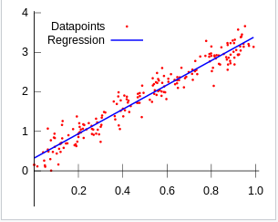
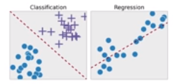
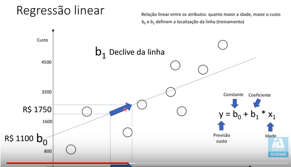
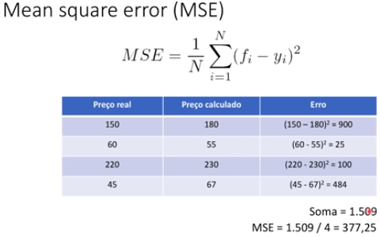
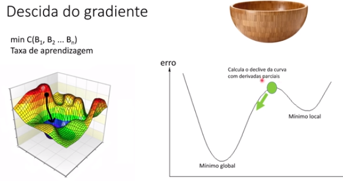

# README Python Regressão Linear

# 1. Introdução

O objetivo deste documento é explorar **Regressão Linear** com Python e **AI - Artificial Intelligence**.

PS: Baseado no treinamento do Youtuber [Jones Granatyr](https://www.youtube.com/channel/UCaGrIWpwjWXT6OIQh9W4Riw)

# 2. Documentação

* Jupyter-Notebook deste exercício disponível [PythonNumPy.ipynb](../src/ipynb/07-PythonRegressaoLinear/PythonRegressaoLinear.ipynb)

## 2.1. O que é Regressão Linear
[Regressão LInear ](README_Conceitos_AI#regressao_linear) em estatística ou econometria, regressão linear é uma equação para se estimar a condicional (valor esperado) de uma variável y, dados os valores de algumas outras variáveis x.

## 2.2. Regressão Linear: Previsão vs Classificação
No contexto de **Regressão Linear**, vejamos as semelhanças e diferenças entre **Previsão** e **Classificação**:

* Semelhanças entre **Previsão** e **Classificação**:
    * Constrói-se um modelo de relação das variáveis numéricas (variável dependente **y** e variável explanatória **x** (ou atributos previsores)
	* Usa-se o modelo para prever valores desconhecidos
* Diferenças entre **Previsão** e **Classificação**:
    * **Previsão** é apropriada para modelar funções contínuas
    * **Classificação** diz respeito à previsão de um rótulo de uma classe

## 2.3. Tipos de regressão linear
* **Regressão linear simples**: quando temos uma única variável explanatória (x)
* **Regressão Linear Múltipla**: Regressão múltipla é uma coleção de técnicas estatísticas para construir modelos que descrevem de maneira razoável relações entre várias variáveis explicativas de um determinado processo. A diferença entre a regressão linear simples e a múltipla é que na múltipla são tratadas duas ou mais variáveis explicativas.

	
## 2.4. Exemplos
* {Temperatura, umidade e pressão do ar} (x) `->` velocidade do vento (y)
* {Gastos no cartão de crédito, histórico} (x)  `->` limite do cartão (y)
* Idade (x) `->` custo do plano de saúde
* Tamanho da casa (x) `->` preço da casa

## 2.5. Exemplo gráfico: idade vs custo plano de saúde

* Com base na idade da pessoa, queremos utilizar regressão linear para prever o custo do plano de saúde.
* Supondo a variável explanatória __idade__ (x), com base no histórico desejamos prever a variável dependente __custo do plano de saúde__ (y) 
* O processo de **aprendizado** no algorítimo de **Regressão Linear** é encontrar os melhores valores para `b0` e `b1`
* O parâmetro `b1` é considerado o declive da linha

## 2.6. Modelo matemático, erro

* Para avaliar se a modelo da reta traçada está se adequando aos pontos existentes, calcula-se o erro de cada ponto até a linha
* Para medir o **erro** a técnica mais utilizada é o **Mean Square Error** ou método dos mínimos erros ao quadrado
* O método **Mean Square Error** penaliza os maiores erros

* Para fazer a minimização dos erros, há duas estratégias de cálculo:
    * **Design Matrix**: Álgebra Linear
        * Base de dados com poucos atributos
        * Inversão de matrizes tem custo computacional alto
    * **Gradient Descent**: Descida do Gradiente
        * Desempenho melhor com muitos atribuitos

	
    
# Referências

* [Wikipedia Regressão Linear](https://pt.wikipedia.org/wiki/Regress%C3%A3o_linear)
* [Vídeo Introdução a Regressão Linear](https://www.youtube.com/watch?v=ltRVgNsZBXE&list=PLORrDfZD1hkE-STpneL0hV3_m2tjv0qAq)
